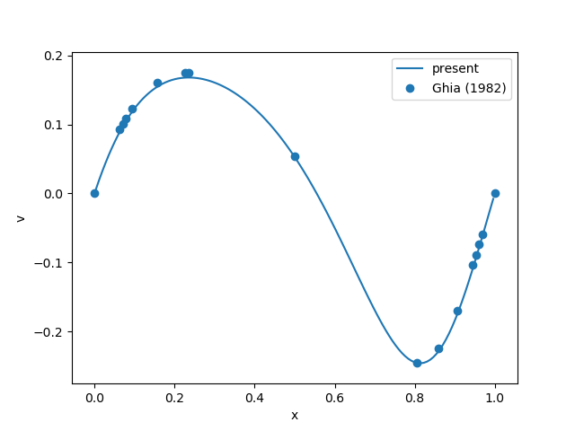
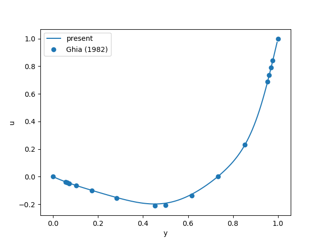

## sample2 : lid-driven square cavity flow
計算条件:config.txt

このサンプルは, 正方キャビティ流れを解析します.
詳細はconfig.txtを参照してください.

計算結果に関しては, Ghiaらの論文[1]を参照する. 比較用のデータとグラフ描画スクリプト(Python)を同梱している. 

## 参考画像 

移流スキームを中心差分として, 30,000ステップまで計算. 格子数127x127.
### 
#### キャビティ重心を通る水平線上の鉛直速度成分.

#### キャビティ重心を通る鉛直線上の水平速度成分.

## 参考文献
1.  Ghia U, Ghia KN, Shin CT (1982) High-Re solutions for incompressible flow using the Navier-Stokes equations and a multigrid method. Journal of Computational Physics 48:387–411. https://doi.org/10.1016/0021-9991(82)90058-4

